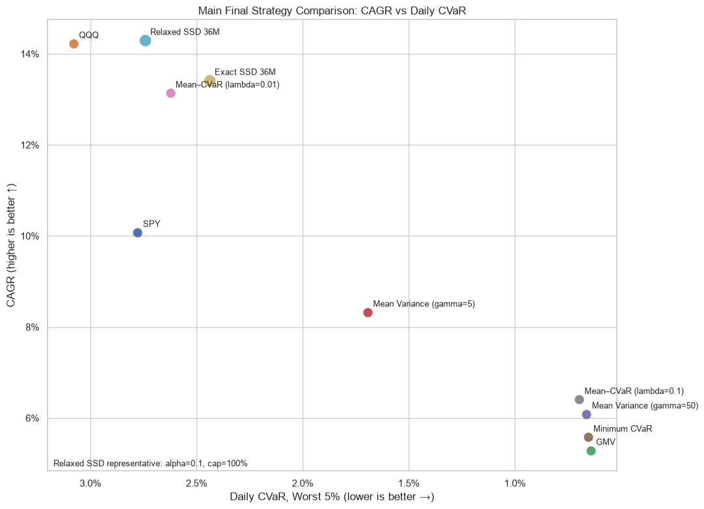
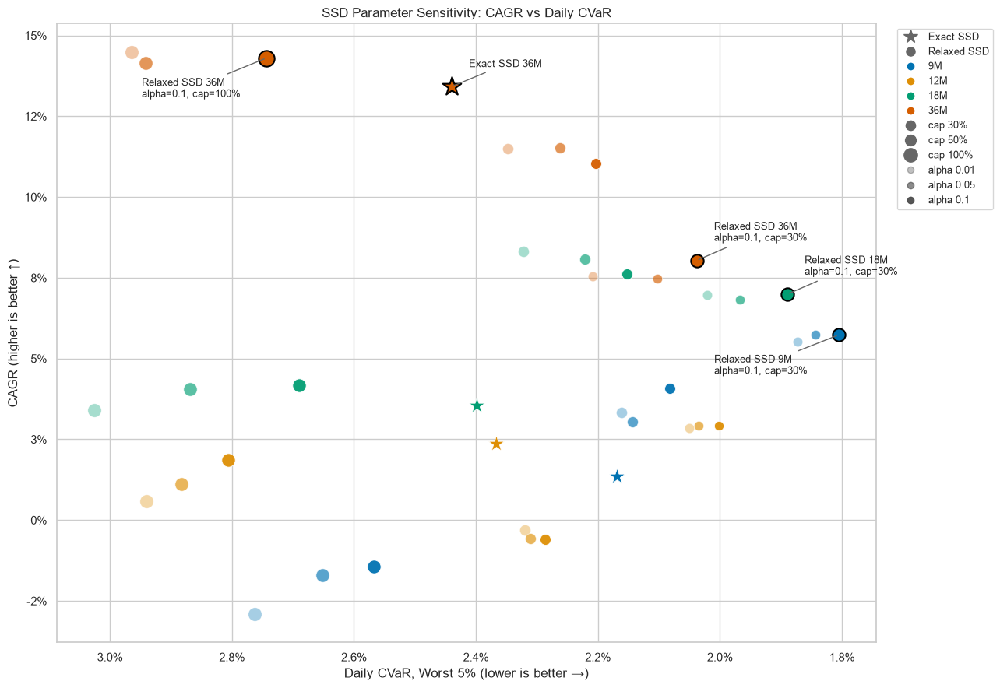
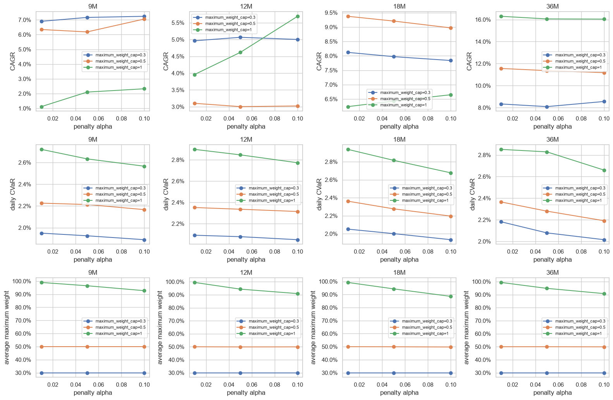

# Portfolio Optimization — Project Results

This short report summarizes the current out-of-sample results of the portfolio optimization project.  
Detailed formulations and implementation are kept in the notebooks; the purpose here is simply to make the figures self-contained and easy to interpret.

## 1. Final strategy comparison

Each point represents one portfolio strategy evaluated over the same common out-of-sample period.

- **x-axis:** Daily 95% CVaR. Lower is better; the axis is reversed, so points farther to the **right** have lower realized tail risk.
- **y-axis:** CAGR. Higher is better.
- Therefore, the preferred direction is toward the **upper-right**.

The comparison includes standard benchmark and optimization strategies:

- **SPY / QQQ:** passive equity benchmarks.
- **GMV:** global minimum-variance portfolio.
- **Minimum CVaR:** portfolio optimized directly for minimum tail risk.
- **Mean–Variance:** mean–variance portfolios with different risk-aversion parameters.
- **Mean–CVaR:** portfolios trading off expected return against CVaR.
- **Exact SSD 36M:** exact second-order stochastic-dominance portfolio using a 36-month estimation window.
- **Relaxed SSD 36M:** Relaxed SSD using a 36-month estimation window, the **largest configured penalty alpha (0.10)**, and **maximum-weight cap = 1.0**. Under the long-only fully invested setup, this is effectively uncapped.

The Exact SSD and Relaxed SSD points are deliberately compared without an additional concentration cap on the Relaxed SSD portfolio. This makes the difference easier to interpret as primarily the effect of replacing the hard SSD constraint with a penalized relaxation.

---

## 2. SSD parameter sensitivity

This figure focuses only on the SSD family. Every plotted point is one complete out-of-sample strategy.

### Exact SSD points

- **Star marker:** Exact SSD.
- **Color:** estimation-window length (9M, 12M, 18M, or 36M).

Exact SSD has no penalty-alpha parameter and no additional maximum-weight cap in this experiment.

### Relaxed SSD points

- **Circle marker:** Relaxed SSD.
- **Color:** estimation-window length.
- **Marker size:** maximum-weight cap (30%, 50%, or 100%).
- **Marker shade / alpha encoding:** penalty-alpha level (0.01, 0.05, or 0.10).

So each Relaxed SSD circle corresponds to one parameter triple:

`(estimation window, penalty alpha, maximum-weight cap)`.

For example:

- **Relaxed SSD 36M, alpha = 0.10, cap = 100%**  
  uses 36 months of history, the strongest configured SSD-distance penalty, and no binding concentration cap.

- **Relaxed SSD 36M, alpha = 0.10, cap = 30%**  
  keeps the same estimation window and penalty strength but restricts every asset to at most 30% of the portfolio.

- **Relaxed SSD 18M / 9M, alpha = 0.10, cap = 30%**  
  keep the same penalty and concentration rule while changing only the estimation window.

As in the first figure, moving **up** means higher realized CAGR and moving **right** means lower realized CVaR.

The main purpose of this plot is not to rank every point individually. It is to separate three effects:

1. **Exact vs. Relaxed SSD:** hard dominance constraint versus penalized relaxation.
2. **Maximum-weight cap:** the effect of limiting portfolio concentration.
3. **Estimation window:** the effect of changing the historical sample used to estimate the return distributions.

---

## 3. Relaxed SSD parameter diagnostics

This figure shows how the Relaxed SSD results change across the parameter grid.

- **Columns:** estimation windows (9M, 12M, 18M, 36M).
- **x-axis:** penalty alpha.
- **Line color:** maximum-weight cap (30%, 50%, 100%).

The three rows show:

1. **CAGR**
2. **Daily CVaR**
3. **Average maximum portfolio weight**

The bottom row is especially useful for interpreting the first two rows.  
The 30% and 50% caps are generally binding, while the 100% case often allows the optimizer to place roughly 90–100% of the portfolio in a single asset.

This explains why the maximum-weight constraint has a large effect on both return and tail risk: it is not a cosmetic parameter, but a strong concentration control.

---

## Where to find the algorithms

The report intentionally keeps the methodology short.

- **Exact SSD:** see Notebook 07.
- **Relaxed SSD and parameter sensitivity:** see Notebook 08.
- **Final common-period comparison:** see Notebook 09.

The notebooks contain the full mathematical formulations, solver logic, rolling backtest construction, and diagnostics.
